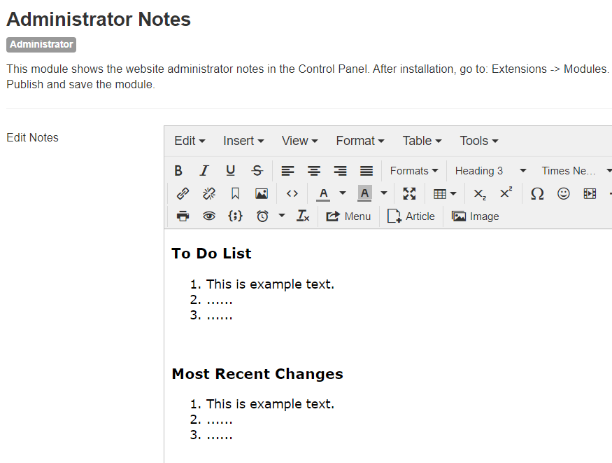
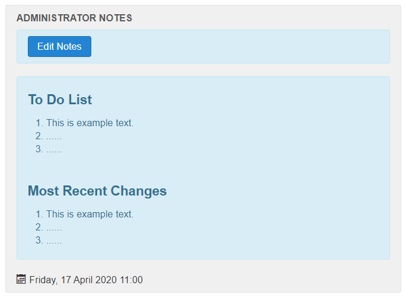

# mod_adminnotes

### INTRODUCTION ###
**This Joomla! module shows administrator notes in the control panel.**

*NOTE: This version is still a beta version and not suitable for a production site. Please test.*

### DESCRIPTION ###

**This module shows in the Control Panel the website administrator notes. After installation, go to: Extensions -&gt; Modules, click on "Administrator Notes" and set the Access level. The Position is cpanel.**

**Click on the button "Edit Notes" in the Control Panel to make notes. Change the example text as desired.**

### FEATURES ###

* To make administrator notes, e.g.: a To Do List.
* Button for direct editing.
* Sample text as default in editor.
* To make links to back-end menu and article items that are often used.
* To make links to frond-end items (../index.php).
* For documentation purposes, e.g.: define large photos are x by y px, thumbnails are x by y px large.
* Uses Joomla! Update System.

### INSTALLATION ###

* Download the master branche source code.
* Go to the Joomla! Extension Manager:
* Extensions > Manage > Install > [Upload & Install] 
* Extensions > Manage > Modules (Administrator) > [Configure module]

  - *Title:* Administrator Notes
  - *Show Title:* Show
  - *Position:* cpanel
  - *Status:* Published
  - *Access:* Special
  - *Administrator Notes:* [Your input]

### VIEW MODULE (administrator) ###

### RESULT IN CONTROL PANEL ###

### LANGUAGE FILES ###

* English
* Dutch

### CREDITS + REFERENCE ###

* On the forum of [JoomlaCommunity.nl](https://JoomlaCommunity.nl) a question was "How to make a note in the Joomla backend" ("Notitie maken in Joomla backend"). That is how the idea arose to build a simple module for it.
* Reference: [joomlacommunity.nl/forum](https://www.joomlacommunity.nl/forum/3rd-party-extensies/notitie-maken-in-joomla-backend) 
* Reference: [joomla.stackexchange.com](https://joomla.stackexchange.com/questions/18393/take-notes-in-backend) 
* Please test this module. Ideas for improvement are welcome.

### VERSION + USE ###

* Latest version: 0.1.3 (beta)
* Type: module (administrator)
* Since Joomla! 3.9
* License: GNU General Public License version 2 or later; see LICENSE.txt.
* This program is distributed, WITHOUT ANY WARRANTY, in the hope that it will be useful.

### CHANGELOG ###

* Version: 0.1.0 - 0.1.3
* Comment: beta versions
* Version: 0.0.1 - 0.0.6
* Comment: first versions ever
